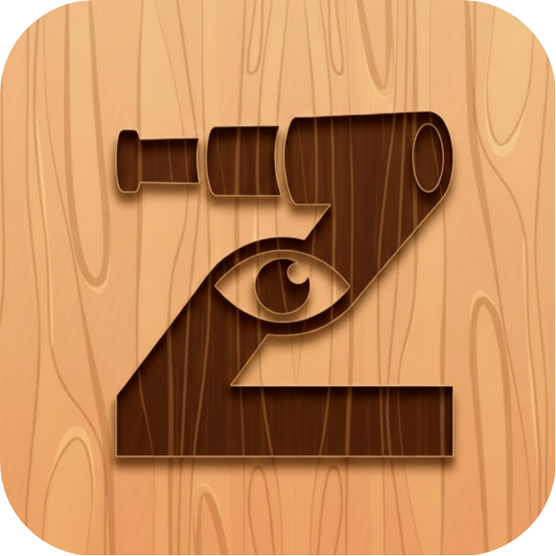

# 🕵️‍♂️ Serr Game

[](https://flutter.dev/)
[](https://dart.dev/)
[](https://opensource.org/licenses/MIT)


A professional, feature-rich Flutter game designed for fun and engagement. Serr provides an immersive experience with a sleek UI, multiple game modes, and robust topic management.



## ✨ Features

- **🎮 Engaging Gameplay**: Dynamic game logic with support for multiple players and roles.
- **🌍 Localization Support**: Fully localized in **English** and **Arabic**, adapting to the user's preference.
- **🌗 Dark & Light Themes**: Beautifully designed themes with automatic system detection and manual toggle.
- **📂 Smart Topic Management**:
  - Offline storage using **Hive**.
  - Cloud synchronization with **Firebase Firestore**.
  - Import topics from text files.
- **🎫 Scratch Card Effect**: Interactive reveal mechanics using the `scratcher` package.
- **📱 Responsive Design**: Optimized for various screen sizes and orientations.
- **💾 Offline Persistence**: Your game data (players, settings) is saved locally.

## 🛠️ Tech Stack

Built with ❤️ using **Flutter** and **Dart**.

### Core
- **[Flutter](https://flutter.dev/)**: Google's UI toolkit for building natively compiled applications.
- **[Dart](https://dart.dev/)**: The programming language for apps on any platform.

### State Management & Architecture
- **[Flutter Bloc](https://pub.dev/packages/flutter_bloc)**: Predictable state management library.
- **Feature-First Architecture**: Modular and scalable project structure.

### Backend & Storage
- **[Firebase](https://firebase.google.com/)**:
  - `firebase_core`: Initialization.
  - `cloud_firestore`: Real-time cloud database for topic updates.
- **[Hive](https://pub.dev/packages/hive)**: Lightweight and blazing fast key-value database for local storage.

### UI & UX
- **[Google Fonts](https://pub.dev/packages/google_fonts)**: For the beautiful **Cairo** typography.
- **[Scratcher](https://pub.dev/packages/scratcher)**: For the interactive scratch card widget.
- **[Flutter Launcher Icons](https://pub.dev/packages/flutter_launcher_icons)**: Custom app icons.

### Utilities
- **[Intl](https://pub.dev/packages/intl)** & **[Flutter Localizations](https://pub.dev/packages/flutter_localizations)**: Internationalization support.
- **[Equatable](https://pub.dev/packages/equatable)**: Value equality for Dart objects.
- **[Image Picker](https://pub.dev/packages/image_picker)** & **[File Picker](https://pub.dev/packages/file_picker)**: Media handling.

## 🚀 Getting Started

### Prerequisites
- **Flutter SDK**: `^3.5.0`
- **Dart SDK**: Compatible with Flutter SDK.

### Installation

1.  **Clone the repository**:
    ```bash
    git clone https://github.com/your-username/serr-game.git
    cd serr-game
    ```

2.  **Install dependencies**:
    ```bash
    flutter pub get
    ```

3.  **Run the app**:
    ```bash
    flutter run
    ```

### Building for Production

To build the APK for Android:
```bash
flutter build apk --release
```

## 📁 Project Structure

```
lib/
├── core/            # Shared utilities, constants, and models
├── features/        # Feature-based modules (Game, Home, Settings, Splash)
├── l10n/            # Localization files (.arb)
└── main.dart        # Application entry point
```

## 🤝 Contributing

Contributions are welcome! Please fork the repository and submit a pull request.

1.  Fork the Project
2.  Create your Feature Branch (`git checkout -b feature/AmazingFeature`)
3.  Commit your Changes (`git commit -m 'Add some AmazingFeature'`)
4.  Push to the Branch (`git push origin feature/AmazingFeature`)
5.  Open a Pull Request

## 📄 License

Distributed under the MIT License. See `LICENSE` for more information.
